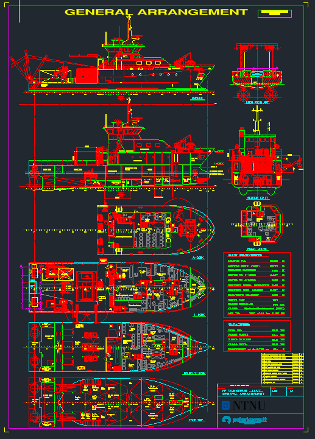

# Gunnerus Open Data Set

## About the project

Design and engineering material for the vessel is normally proprietary, which makes it hard for students and researchers to work on realistic, complete ship data.

This repository makes a curated set of Gunnerus-related material publicly available so that it can be used as a **reference ship case** for:

- research on ship design, hydrodynamics, structures and digital ship models
- teaching and student projects
- benchmarking, validation and reproducible experiments
- development and testing of digital shipbuilding tools and data formats

*Excerpt from the Gunnerus general arrangement drawing.*

Publishing it openly is intended to benefit the maritime research and education community, while keeping polarkonsult's commercial interests intact (see [Credit & License](#credit--license)).

## Repository contents

The repository holds three production drawings of R/V Gunnerus, each supplied as DWG, DXF and a plotted A0 PDF sheet dated 2026-08-19:

| Drawing | Folder | Contents |
| --- | --- | --- |
| **General arrangement** — `165821B7 GA Gunnerus Rev1`, scale 1:100 | [`polarkonsult/`](polarkonsult/) | Profile and inboard profile, A-deck, 1-deck, below 1-deck and tank top plans, wheelhouse, section at frame 17 and the view from aft, with main dimensions and capacity tables. |
| **Tank plan** — `166151A3 Tankplan Rev1`, scale 1:50 | [`polarkonsult/`](polarkonsult/) | Tank arrangement in profile and on the tank top, with a tank schedule giving frame range, net volume and mass per fluid type (technical water, fuel oil, fresh water, lube oil, misc.) for tanks 1–13 and the cargo hold — 180.03 m³ in total — plus a separate table for tanks 14 and 15 added in the lengthening. |
| **Lines plan** — `LINES PLAN Rev0`, scale 1:100 | [`extended/CJOB/`](extended/CJOB/) | The moulded hull form as sheer plan, body plan and half-breadth plan, with the main particulars table reproduced below. |

 Per the title blocks, the general arrangement and tank plan were designed by **polarkonsult** for NTNU; the lines plan was designed by **C-JOB**.

Two further folders hold material derived from the drawings rather than the drawings themselves:

| Folder | Contents |
| --- | --- |
| [`metadata/`](metadata/) | Machine-readable metadata extracted from the GA drawing — see below. |
| [`docs/images/`](docs/images/) | Preview images used in this README. |

The CAD formats:

| Format | Notes |
| --- | --- |
| `.dwg` | Native AutoCAD drawing (AC1032 / AutoCAD 2018 format) — the authoritative source |
| `.dxf` | ASCII exchange format, for tools that cannot read DWG |
| `.pdf` | Plotted A0 sheet, for quick viewing |

Drawing units are millimetres; waterlines are labelled `WL <mm>` above the baseline and stations by frame number, running from frame 0 at the aft perpendicular to frame 60 at the forward perpendicular at 500 mm spacing.

All three sheets carry the licence terms in the title block: *open use for research/teaching and other non-commercial activities, commercial use not permitted without approval (CC BY-NC 4.0)*.

## Metadata

[`metadata/gunnerus_metadata.json`](metadata/gunnerus_metadata.json) makes the content of the general arrangement drawing available without opening a CAD file. It covers vessel identity and drawing reference, main dimensions, capacities, a 26-entry tank list, 38 spaces across the five decks, and an inventory of 14 items of equipment.

Entries are classified by **SFI group**, the standard maritime technical and cost classification, and where the mapping is unambiguous cross-referenced to a **DNV VIS/GMOD v3.10a** top-level node — so the data can be joined against other SFI- or VIS-coded datasets. Every block is provenance-tagged with the part of the drawing it was read from.

The file is derived from the general arrangement alone, not from class documents or the stability book, and it records its own gaps: unreconciled tank entries — now superseded by the tank plan — and one equipment item identified from geometry rather than a label. [`metadata/README.md`](metadata/README.md) documents the structure, the units and null convention, and these limitations in full.

## Vessel

[R/V Gunnerus](https://www.ntnu.edu/gunnerus) is a research vessel owned and operated by the Norwegian University of Science and Technology (NTNU). In service since 2006 and based in Trondheim, she supports research and teaching in biology, technology, geology, archaeology, oceanography and fisheries, with dynamic positioning, cranes and winches for deploying sampling equipment and underwater robotics. NTNU's vessel pages at <https://www.ntnu.edu/gunnerus> carry booking information, technical specifications and live position tracking.

Main particulars as stated on the lines plan:

| Property | Value |
| --- | --- |
| Name | R/V Gunnerus (*FF Gunnerus*, call sign LNVZ) |
| Owner / operator | NTNU |
| Designer | polarkonsult |
| Length over all | 36.25 m |
| Length between perpendiculars | 33.90 m |
| Breadth moulded | 9.60 m |
| Depth to 1-deck | 4.287 m |
| Depth to A-deck | 6.687 m |
| Draught, normal operative | 2.50 m |
| Draught, max. loaded | 2.787 m |
| Deadweight at d = 2.786 m | 169 t |
| Rise of floor | 585 mm |
| Rake of keel | 1140 mm |
| Class | DNV +1A1 Ice C E0 R2 |

The three sheets do not agree on all of these. Where they differ:

| Particular | Lines plan | General arrangement | Tank plan |
| --- | --- | --- | --- |
| Depth to 1-deck | 4.287 m | 4.287 m | **4.20 m** |
| Depth to A-deck | 6.687 m | **6.60 m** | **6.60 m** |
| Draught, max. loaded | 2.787 m | 2.787 m | **2.70 m** |
| Deadweight at d = 2.786 m | 169 t | **164 t** | — |

Check these against the current stability book before using any of them. The general arrangement and tank plan also carry figures the lines plan does not — gross tonnage 430, scantling draught 2.90 m and flag authority Sjøfartsdirektoratet (NMD) — and the GA values are in the metadata file.

## Credit & License

The material in this repository is licensed under the
**[Creative Commons Attribution-NonCommercial 4.0 International (CC BY-NC 4.0)](https://creativecommons.org/licenses/by-nc/4.0/)** license.
The full license text is in [LICENSE](LICENSE).

This means:

- **Open for non-commercial use** — you are free to use, share and adapt the material for research, teaching and other non-commercial activities.
- **No commercial use (NC)** — commercial use is not permitted unless polarkonsult approves it. Contact to request permission.
- **As-is** — the material is provided *as-is*, with **no warranty, responsibility or liability** of any kind. Use of the material is entirely at your own risk.

### Polarkonsult's rights

Polarkonsult (<https://www.polarkonsult.com/>)remains free to use Gunnerus-related data, and to continue using or adapting the design commercially. Publishing under CC BY-NC 4.0 does not transfer ownership and does not restrict polarkonsult's own use of the material in any way.

### Referring to this initiative

NTNU may refer to this open data initiative and to polarkonsult's contribution in communication and dissemination material.

### How to attribute

When you use this material, include an attribution such as:

> Gunnerus open data, courtesy of polarkonsult, published by NTNU.
> Licensed under CC BY-NC 4.0 — https://creativecommons.org/licenses/by-nc/4.0/

If you have modified the material, state that changes were made.

### Note on software

CC BY-NC 4.0 is intended for data, drawings and documentation, not for source code. If scripts or software are added to this repository later, they should be placed in a clearly separated folder with their own software license.

## Contact

<!-- TODO: add contact points before publishing. -->

- Data / dataset questions (NTNU): Henrique Gaspar (henrique.gaspar@ntnu.no)
- Commercial use requests (polarkonsult approval): Polarkonsult (<https://www.polarkonsult.com/>)
