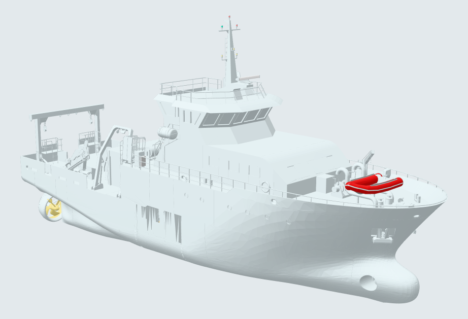

# Gunnerus Open Data Set

**Production drawings, a 3D model, engineering documents and structured metadata for the NTNU research vessel R/V Gunnerus, published openly for research and teaching.**

[](https://creativecommons.org/licenses/by-nc/4.0/)
[](https://shiplab.github.io/gunnerus/)
<!-- After the first Zenodo release, replace this comment with the concept-DOI badge Zenodo gives you, e.g.
[](https://doi.org/10.5281/zenodo.XXXXXXX) -->

[](https://shiplab.github.io/gunnerus/#model)

*The C-JOB 3D model of R/V Gunnerus. [Rotate it in your browser](https://shiplab.github.io/gunnerus/#model).*

| At a glance | |
| --- | --- |
| Drawings | 15 production drawings, each as DWG, DXF and A0 PDF |
| 3D model | Rhino `.3dm` and STEP, hull and superstructure, plus a lightweight glTF in [`derived/`](derived/README.md) |
| Documents | 5 engineering documents: weight, tonnage, specification, equipment and document lists |
| Metadata | GA drawing as JSON, coded by SFI group and DNV VIS/GMOD |
| Licence | CC BY-NC 4.0 (engineering documents: CC BY-SA 4.0) |
| Website | <https://shiplab.github.io/gunnerus/> |

## About

Design and engineering material for a vessel is normally proprietary. That makes it hard for students and researchers to work on realistic, complete ship data.

This repository makes a curated set of Gunnerus material publicly available as a **reference ship case** for:

- research on ship design, hydrodynamics, structures and digital ship models
- teaching and student projects
- benchmarking, validation and reproducible experiments
- development and testing of digital shipbuilding tools and data formats

Everything published here traces back to drawings by the vessel's designer, **polarkonsult**. Some sheets are polarkonsult originals; others are derivative works by **C-JOB** and NTNU. All of it is published by **NTNU**. Publishing openly is intended to benefit the maritime research and education community while keeping polarkonsult's commercial interests intact (see [Licence](#licence)).

## Get the data

**Browse or download single files** on GitHub, or from the drawing gallery on the [website](https://shiplab.github.io/gunnerus/#drawings).

**Clone the repository.** The two 3D model files (about 1.1 GB) are stored with [Git LFS](https://git-lfs.com/):

```sh
# Everything, including the 3D model (install Git LFS first)
git lfs install
git clone https://github.com/shiplab/gunnerus.git

# Drawings, documents and metadata only; skips the 1.1 GB 3D model
GIT_LFS_SKIP_SMUDGE=1 git clone https://github.com/shiplab/gunnerus.git

# Fetch the 3D model later, from inside the clone
git lfs pull
```

**Download a release.** Each tagged [release](https://github.com/shiplab/gunnerus/releases) is archived on Zenodo with its own DOI. Use a release when you need to cite a fixed version of the data.

## Contents

### Drawings

Each drawing is supplied as `.dwg`, `.dxf` and a plotted A0 `.pdf`. The folders are named after the design office each drawing comes from.

| Drawing | Folder | Scale | Sheet date |
| --- | --- | --- | --- |
| [General arrangement](polarkonsult/GA%20Gunnerus%20Rev1.pdf) (`GA Gunnerus Rev1`) | [`polarkonsult/`](polarkonsult/README.md) | 1:100 | 2026-08-19 |
| [Tank plan](polarkonsult/Tank%20Plan%20Rev1.pdf) (`Tank Plan Rev1`) | [`polarkonsult/`](polarkonsult/README.md) | 1:50 | 2026-08-19 |
| [Lines plan](polarkonsult/Lines%20Plan%20Rev0.pdf) (`Lines Plan Rev0`) | [`polarkonsult/`](polarkonsult/README.md) | 1:100 | 2026-08-19 |
| [Profile and plan](polarkonsult/Profile%20and%20Plan%20Rev0.pdf) (`Profile and Plan Rev0`) | [`polarkonsult/`](polarkonsult/README.md) | 1:50 / 1:25 / 1:10 | 2026-08-31 |
| [Midship section](polarkonsult/Midship%20Section%20Rev0.pdf) (`Midship Section Rev0`) | [`polarkonsult/`](polarkonsult/README.md) | 1:50 | 2026-08-31 |
| [Shell expansion](polarkonsult/Shell%20Expansion%20Rev0.pdf) (`Shell Expansion Rev0`) | [`polarkonsult/`](polarkonsult/README.md) | 1:50 | 2026-08-31 |
| [Engine room arrangement](extended/CJOB/Engine%20Room%20Arrangement%20Rev0.pdf) | [`extended/CJOB/`](extended/CJOB/README.md) | 1:100 | 2026-08-31 |
| [Construction plan, deck and double bottom](extended/CJOB/Construction%20Plan%20Deck%20and%20Double%20Bottom%20Rev0.pdf) | [`extended/CJOB/`](extended/CJOB/README.md) | 1:50 | 2026-09-11 |
| [Construction plan, longitudinal section](extended/CJOB/Construction%20Plan%20Longitudinal%20Section%20Rev0.pdf) | [`extended/CJOB/`](extended/CJOB/README.md) | 1:50 | 2026-09-25 |
| [Construction plan, transverse section](extended/CJOB/Construction%20Plan%20Transverse%20Section%20Rev0.pdf) | [`extended/CJOB/`](extended/CJOB/README.md) | 1:50 | 2026-09-25 |
| [Draught and hullmarks](extended/CJOB/Draught%20and%20Hullmarks%20Rev0.pdf) | [`extended/CJOB/`](extended/CJOB/README.md) | 1:50 | 2026-09-11 |
| [Freeboard plan](extended/CJOB/Freeboard%20Plan%20Rev0.pdf) | [`extended/CJOB/`](extended/CJOB/README.md) | 1:150 | 2026-09-25 |
| [Retractable telescopic diver's platform arrangement](extended/CJOB/Retractable%20Telescopic%20Diver's%20Platform%20Arrangement%20Rev0.pdf) | [`extended/CJOB/`](extended/CJOB/README.md) | 1:25 | 2026-09-25 |
| [Safety fire zone plan](extended/CJOB/Safety%20Fire%20Zone%20Plan%20Rev0.pdf) | [`extended/CJOB/`](extended/CJOB/README.md) | 1:100 | 2026-09-11 |
| [Tank arrangement](extended/CJOB/Tank%20Arrangement%20Rev0.pdf) | [`extended/CJOB/`](extended/CJOB/README.md) | 1:100 | 2026-09-11 |

The folder READMEs describe what each sheet shows. [`polarkonsult/README.md`](polarkonsult/README.md) covers the six polarkonsult sheets. [`extended/CJOB/README.md`](extended/CJOB/README.md) covers the nine C-JOB sheets, with their C-JOB document numbers.

### Other material

| Folder | Contents |
| --- | --- |
| [`extended/CJOB/3d models/`](<extended/CJOB/3d models/README.md>) | 3D CAD model of the hull and superstructure: Rhino `.3dm` (~396 MB) and STEP `.stp` (~728 MB), stored with Git LFS. |
| [`extended/CJOB/docs/`](extended/CJOB/docs/README.md) | C-JOB engineering documents: weight calculation (411.79 t light ship), gross and net tonnage calculation, specification, list of main equipment, list of project documents. **Licensed CC BY-SA 4.0.** |
| [`metadata/`](metadata/README.md) | The general arrangement drawing as structured JSON. See [Metadata](#metadata). |
| [`derived/`](derived/README.md) | Files made by NTNU from the published material or earlier Shiplab projects: a 3.5 MB glTF of the C-JOB model, a textured visual model, and the vessel.js ship specification with hull offsets as CSV. For visualisation and teaching, not a source for dimensions. |
| [`pages/`](pages/README.md) | Source of the [website](https://shiplab.github.io/gunnerus/). |
| [`images/`](images/README.md) | Images used in this README. |

### Formats and conventions

| Format | Notes |
| --- | --- |
| `.dwg` | Native AutoCAD drawing (AC1032, AutoCAD 2018 format). The authoritative source. |
| `.dxf` | ASCII exchange format, for tools that cannot read DWG. |
| `.pdf` | Plotted A0 sheet, for quick viewing. |

- **Units.** Drawing units are millimetres. Waterlines are labelled `WL <mm>` above the baseline.
- **Frames.** Frames are numbered from 0 at the aft perpendicular to 60 at the forward perpendicular, at 500 mm spacing. Lettered sub-frames amidships account for the extra length (33.90 m between perpendiculars), so frame number × 500 mm is not a position in metres.
- **Sheet dates** are the dates of the issue published here, not the original design dates. The vessel has been in service since 2006.
- **Licence on the sheets.** Every title block carries the terms *open use for research/teaching and other non-commercial activities, commercial use not permitted without approval (CC BY-NC 4.0)*.

## Metadata

[`metadata/gunnerus_metadata.json`](metadata/gunnerus_metadata.json) makes the content of the general arrangement drawing available without opening a CAD file. It covers vessel identity and drawing reference, main dimensions, capacities, a 26-entry tank list, 38 spaces across five decks, and an inventory of 14 items of equipment.

Entries are classified by **SFI group**, the standard maritime technical and cost classification. Where the mapping is unambiguous, they are cross-referenced to a **DNV VIS/GMOD v3.10a** top-level node, so the data can be joined against other SFI- or VIS-coded datasets. Every block records which part of the drawing it was read from.

The file is derived from the general arrangement alone, not from class documents or the stability book. [`metadata/README.md`](metadata/README.md) documents the structure, units, the `null` convention and the known limitations.

## The vessel

[R/V Gunnerus](https://www.ntnu.edu/gunnerus) is a research vessel owned and operated by the Norwegian University of Science and Technology (NTNU). In service since 2006 and based in Trondheim, she supports research and teaching in biology, technology, geology, archaeology, oceanography and fisheries, with dynamic positioning, cranes and winches for deploying sampling equipment and underwater robotics. NTNU's [vessel pages](https://www.ntnu.edu/gunnerus) carry booking information, technical specifications and live position tracking.

Main particulars as stated on the lines plan:

| Property | Value |
| --- | --- |
| Name | R/V Gunnerus (*FF Gunnerus*, call sign LNVZ) |
| Owner and operator | NTNU |
| Designer | polarkonsult |
| Length overall | 36.25 m |
| Length between perpendiculars | 33.90 m |
| Breadth, moulded | 9.60 m |
| Depth to 1-deck | 4.287 m |
| Depth to A-deck | 6.687 m |
| Draught, normal operating | 2.50 m |
| Draught, maximum loaded | 2.787 m |
| Deadweight at T = 2.786 m | 169 t |
| Rise of floor | 585 mm |
| Rake of keel | 1140 mm |
| Class | DNV +1A1 Ice C E0 R2 |

## Known issues

Values are kept as printed on each sheet, not silently corrected. Known differences and gaps:

| Issue | Details |
| --- | --- |
| Deadweight | 164 t on the GA drawing; 169 t on the lines plan and engine room arrangement. |
| Depth to A-deck | 6.60 m on the GA drawing; 6.687 m on the lines plan and engine room arrangement. |
| Built year | 2005 on the freeboard plan; 2006 on the safety fire zone plan. 2006 is correct. |
| Shell expansion file | One file holds two sheets: 1/2 starboard side, 2/2 port side. |
| Tank list in the metadata | Does not reconcile with the capacity totals. Use `Tank Plan Rev1` (tanks 1–15, 202.42 m³ net) instead. |
| Propulsion in the metadata | Inferred from geometry and wrong. The engine room arrangement identifies PM azimuth drives, port and starboard. |
| Missing C-JOB deliverables | The C-JOB document list includes a freeboard calculation (`25.1142-000-020`) and a shell expansion drawing (`25.1142-100-123`) that are not in this repository. |

Found another one? [Report a data error](https://github.com/shiplab/gunnerus/issues/new?template=data-error.yml).

## Related projects

The Gunnerus data is used in [vessel.js](https://vesseljs.org/), NTNU Shiplab's open-source JavaScript library for ship design and simulation ([source](https://github.com/shiplab/vesseljs)). Its examples include:

- [Gunnerus browser](https://github.com/shiplab/vesseljs/blob/dev/examples/Gunnerus_Browser.html) and [complete Gunnerus example](https://github.com/shiplab/vesseljs/blob/dev/examples/Gunnerus_Complete_Example.html): the 3D model with the ship specification
- [Manoeuvring](https://github.com/shiplab/vesseljs/blob/dev/examples/manoeuvring.html) and [Trondheim](https://github.com/shiplab/vesseljs/blob/dev/examples/trondheim.html) simulations
- [From concept to simulation](https://github.com/shiplab/vesseljs/tree/dev/examples/observable_examples/from_concept_to_simulation_intro), a course that takes Gunnerus through each step of a digital design process

The visual model and ship specification from those examples are also in [`derived/`](derived/README.md).

## Licence

The material in this repository is licensed under **[Creative Commons Attribution-NonCommercial 4.0 International (CC BY-NC 4.0)](https://creativecommons.org/licenses/by-nc/4.0/)**. The full text is in [LICENSE](LICENSE).

**Exception:** the C-JOB engineering documents in [`extended/CJOB/docs/`](extended/CJOB/docs/README.md) are licensed **[CC BY-SA 4.0](https://creativecommons.org/licenses/by-sa/4.0/)**.

- **Non-commercial use is open.** You may use, share and adapt the material for research, teaching and other non-commercial activities.
- **Commercial use needs approval** from [polarkonsult](https://www.polarkonsult.com/).
- **As is.** The material is provided without warranty, responsibility or liability of any kind. Use it at your own risk.

**polarkonsult's rights.** polarkonsult remains free to use Gunnerus-related data and to continue using or adapting the design commercially. Publishing under CC BY-NC 4.0 does not transfer ownership and does not restrict polarkonsult's own use of the material.

**Referring to this initiative.** NTNU may refer to this open data initiative and to polarkonsult's contribution in communication and dissemination material.

**Software.** CC BY-NC 4.0 is intended for data, drawings and documentation, not source code. Scripts or software added later will go in a clearly separated folder with their own software licence.

### How to attribute

When you use the material, include an attribution such as:

> Gunnerus open data, courtesy of polarkonsult, published by NTNU.
> Licensed under CC BY-NC 4.0 — https://creativecommons.org/licenses/by-nc/4.0/

If you modified the material, state that changes were made.

## How to cite

If you use this data set in a publication, please cite it. GitHub's **Cite this repository** button (in the sidebar) gives APA and BibTeX entries from [`CITATION.cff`](CITATION.cff). To cite a fixed version, use the DOI of that release on Zenodo; replace `XXXXXXX` below with it.

```bibtex
@misc{gunnerus_open_data,
  author       = {Gaspar, Henrique M. and Ha, Jisang and {polarkonsult AS} and {C-JOB Naval Architects}},
  title        = {Gunnerus Open Data Set: drawings, 3D model and metadata of the research vessel R/V Gunnerus},
  publisher    = {Zenodo},
  year         = {2026},
  doi          = {10.5281/zenodo.XXXXXXX},
  howpublished = {\url{https://github.com/shiplab/gunnerus}},
  note         = {Courtesy of polarkonsult, published by NTNU. CC BY-NC 4.0}
}
```

## Contributing and reporting errors

Corrections are welcome. To report a wrong value, a mismatch between sheets or a broken file, [open a data error issue](https://github.com/shiplab/gunnerus/issues/new?template=data-error.yml) and say which drawing and which part of the sheet it concerns. Changes between releases are listed in [CHANGELOG.md](CHANGELOG.md).

## Acknowledgements

The drawings and design data are courtesy of [polarkonsult](https://www.polarkonsult.com/), the designer of R/V Gunnerus. The derivative drawings, 3D model and engineering documents in `extended/CJOB/` were made by [C-JOB](https://c-job.com/) with NTNU. The data set is published by [NTNU](https://www.ntnu.edu/).
