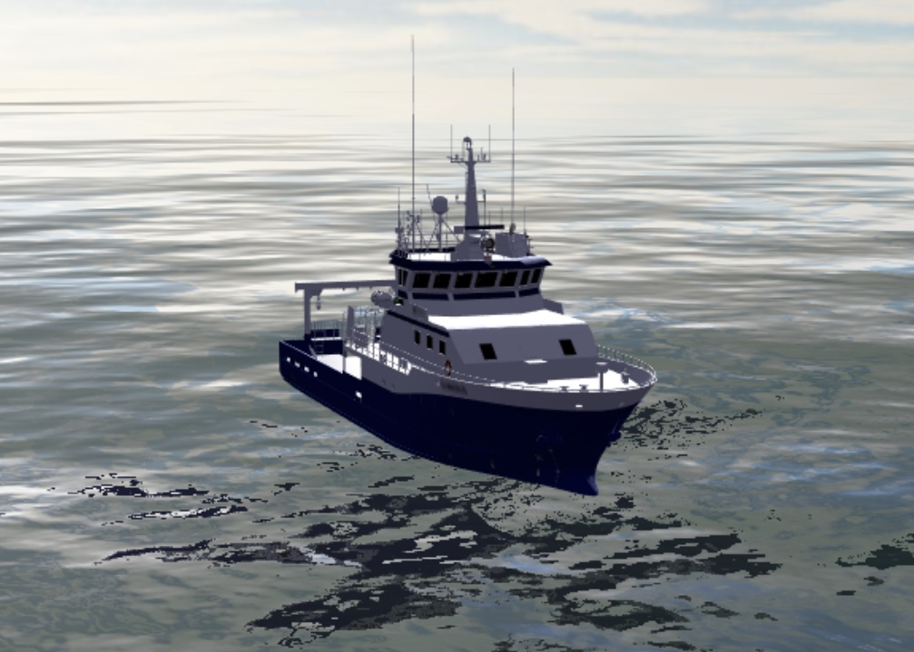

# Derived files

Files made by NTNU from the material in this repository, or brought in from earlier NTNU Shiplab projects. They are conversions and simplifications, not new engineering data. For accurate values, always go back to the source files named below.

> [!IMPORTANT]
> The files come from two different sources, with different precision:
>
> - **Made from this data set:** `3d/gunnerus.glb` is converted directly from the C-JOB 3D model published here.
> - **Older vessel.js material (2020):** `3d/gunnerus-visual.glb`, `3d/gunnerus-visual-preview.jpg`, `vesseljs/gunnerus.json` and `vesseljs/offsets.csv` were made for the vessel.js software examples, years before this data set. They were not made from the drawings published here and are approximate. Expect differences in dimensions, hull form, tanks and rooms. Use them for visualisation, software testing and teaching, not as reference data.

| File | Made from | Purpose |
| --- | --- | --- |
| [`3d/gunnerus.glb`](3d/gunnerus.glb) | [`extended/CJOB/3d models/Gunnerus 3D Model Rev0.3dm`](<../extended/CJOB/3d models/README.md>) (C-JOB) | Lightweight 3D model for web viewers, visualisation and teaching. Used by the [website](https://shiplab.github.io/gunnerus/#model). |
| [`3d/gunnerus-visual.glb`](3d/gunnerus-visual.glb) | The Gunnerus model in [vessel.js](https://github.com/shiplab/vesseljs) (2020) | Textured visual model in the vessel's paint scheme, with named parts. For rendering, simulators and presentations. |
| [`3d/gunnerus-visual-preview.jpg`](3d/gunnerus-visual-preview.jpg) | `3d/gunnerus-visual.glb` | A render of the visual model at sea, from the vessel.js simulator examples. |
| [`vesseljs/gunnerus.json`](vesseljs/gunnerus.json) | The Gunnerus ship specification in [vessel.js](https://github.com/shiplab/vesseljs) (2020) | Hull offsets, decks, bulkheads, compartments and tanks in the vessel.js format, for hydrostatics and design exercises. |
| [`vesseljs/offsets.csv`](vesseljs/offsets.csv) | `vesseljs/gunnerus.json` | The same hull offsets in metres, as a plain table. |

## 3d/gunnerus.glb

A simplified glTF 2.0 binary of the C-JOB 3D model, **3.5 MB** instead of 396 MB.

| Property | Value |
| --- | --- |
| Format | glTF 2.0 binary (`.glb`) |
| Triangles | ~1.59 million (source render meshes: ~3.98 million) |
| Units and axes | Metres, Y up (glTF convention). The source is in millimetres, Z up. |
| Origin | Same as the source model. The keel is at y ≈ 0, so y = 2.50 is the operating draught. |
| Materials | 21 flat colours, one per display colour in the source. No textures. |
| Required extensions | `EXT_meshopt_compression`, `KHR_mesh_quantization` |

### How it was made

1. Read the Rhino 8 file with [rhino3dm](https://github.com/mcneel/rhino3dm) and collected the render meshes stored on every surface and extrusion (about 3.98 million triangles). Curves and text were skipped. The one block instance sits at identity, so its members were taken once.
2. Grouped the meshes by display colour. Three CAD highlight colours (black, magenta, pure green) were remapped to the hull grey (RGB 151, 170, 174).
3. Converted millimetres to metres and Z-up to Y-up.
4. Simplified to about 40 % of the triangles and compressed with [gltfpack](https://github.com/zeux/meshoptimizer) (`gltfpack -si 0.4 -cc`).

### What is lost

- Exact geometry. The source is NURBS surfaces; this file is a simplified triangle mesh with quantised vertex positions. Do not take dimensions from it.
- Object structure. The source layers are unnamed leftovers from an IGES import, so the file carries no part names; parts are only grouped by colour.
- Curves, text and hidden objects.

### Opening it

Web viewers built on three.js or Babylon.js, and most online glTF viewers, read the compressed file directly. Some desktop tools do not support `EXT_meshopt_compression`. For those, make an uncompressed copy (about 21 MB) with gltfpack:

```sh
gltfpack -i gunnerus.glb -o gunnerus-uncompressed.glb -noq
```

gltfpack re-optimises the mesh while doing this, so the triangle count drops slightly (merged duplicate vertices and degenerate triangles).

## 3d/gunnerus-visual.glb

A visual 3D model of R/V Gunnerus, made in Blender, with textures in the vessel's paint scheme (blue hull and bridge band, white superstructure, red bottom) and the hull name and home port as decals.

| Property | Value |
| --- | --- |
| Format | glTF 2.0 binary (`.glb`), 10.9 MB |
| Triangles | ~66 000 |
| Textures | 17 images, 1024 × 1024 (one 2048 × 2048), stored as WebP |
| Named parts | `Hull`, `Deck`, `bridge`, `Railing`, `Stairs`, `radar`, `Exhaust`, `STB_Propeller`, `PTS_Propeller`, `Thruster_Front`, and others |
| Units and axes | Metres, Y up. Length along Z, centred on the origin (about ±18.2 m). The origin differs from `gunnerus.glb`. |
| Required extensions | `EXT_texture_webp` |

**Origin.** Made by [IHB NTNU](https://www.ntnu.edu/ihb) (Department of Ocean Operations and Civil Engineering), as credited in the [OpenBridge simulator demo](https://shiplab.github.io/openbridge/index.html). Taken from the vessel.js repository (`examples/3D_models/GLTF/Gunnerus.glb`), where it was added by Felipe Ferrari in 2020; the OpenBridge demo uses the same file. Its length matches the ship after the lengthening.

**Changes made here.** Textures converted from PNG to WebP (quality 75) and unused data removed with [glTF-Transform](https://gltf-transform.dev/) (`dedup`, `prune`, `webp`). This takes the file from 31.8 MB to 10.9 MB. Geometry, materials and part names are unchanged.



*`gunnerus-visual-preview.jpg`: the model in a vessel.js simulator scene (from `images/Gunnerus.jpg` in vessel.js).*

**Limitations.** This is an artist's model for visualisation. It is not built from the production drawings, so do not take dimensions or arrangements from it.

## vesseljs/gunnerus.json

The Gunnerus ship specification from vessel.js (`examples/ship_specs/gunnerus.json`), added by Felipe Ferrari in 2020. It is copied unchanged, so it loads directly in vessel.js (`Vessel.Ship`), for example in the [vessel.js Gunnerus examples](https://github.com/shiplab/vesseljs/tree/dev/examples).

| Part | Contents |
| --- | --- |
| `structure.hull` | Main dimensions (LOA 36.25 m, BOA 9.60 m, depth 6.60 m) and a half-breadth table: 64 stations × 16 waterlines |
| `structure.decks` | 1-deck (z = 4.286 m) and A-deck (z = 6.686 m) |
| `structure.bulkheads` | Three transverse bulkheads, at x = 5.0, 22.0 and 31.5 m |
| `baseObjects`, `derivedObjects` | 26 compartments, 24 tanks and 3 machinery items as boxes, with positions and SFI codes |
| `designState` | Design values: LWL 34.9 m, draught 2.787 m, Cb 0.626 |

In the vessel.js format, the offset table is normalised: stations are fractions of LOA, waterlines are fractions of depth, and half-breadths are fractions of BOA / 2. `x` runs from the aft end of the hull. Three machinery objects refer to supplier STL files (A-frame, crane, engine) that are not included here.

**Limitations.** Made for software demonstrations and teaching. It has not been checked against the lines plan, and its tank and room list differs from the tank plan and the GA metadata. Use the drawings when accuracy matters.

## vesseljs/offsets.csv

The half-breadth table from `gunnerus.json`, converted to metres so it can be read without vessel.js.

- First row: station positions `x` in metres from the aft end of the hull (0 to 36.25 m).
- First column: waterline heights `z` in metres above the baseline (0 to 7.5 m).
- Cells: half-breadth `y` in metres. Empty cells mean no hull at that point.

## Licence

Derivative works of the repository material, under the same terms: **CC BY-NC 4.0**. See the main [README](../README.md#licence) and [LICENSE](../LICENSE). The copies of `gunnerus-visual.glb` and `gunnerus.json` in the vessel.js repository remain available there under its MIT licence (Copyright (c) 2017 shiplab). When you use `gunnerus.glb`, credit the source:

> Gunnerus open data, courtesy of polarkonsult, published by NTNU. 3D model by C-JOB; simplified glTF by NTNU.
> Licensed under CC BY-NC 4.0 — https://creativecommons.org/licenses/by-nc/4.0/

For the vessel.js files, credit them as:

> Gunnerus open data, published by NTNU. Visual model by IHB NTNU; ship specification by Felipe Ferrari (vessel.js, NTNU Shiplab, 2020).
> Licensed under CC BY-NC 4.0 — https://creativecommons.org/licenses/by-nc/4.0/
