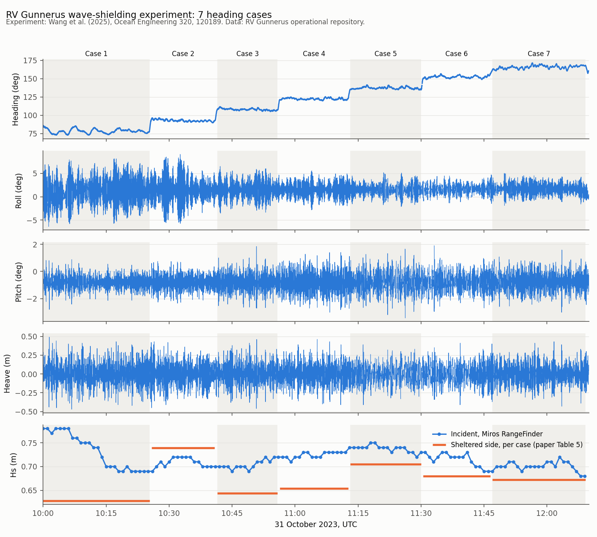

# Wave-shielding experiment, 31 October 2023

Full-scale measurements from RV Gunnerus holding position on DP in Breisundet, west of Ålesund, while her heading was turned in seven steps to find the heading that gives the calmest water, and the smallest crane motion, on her lee side.



## Source and credit

**The experiment, set-up, results and every fact in this README come from:**

> Wang, T., Skulstad, R., Holmeset, F.T., Halse, K.H., Hildre, H.P., Zhang, H. (2025). *Full-scale experimental research on wave shielding effect of RV Gunnerus for offshore operations.* Ocean Engineering 320, 120189. <https://doi.org/10.1016/j.oceaneng.2024.120189> (open access, CC BY 4.0)

All authors are at the Department of Ocean Operations and Civil Engineering, NTNU Ålesund. The work was supported by the Research Council of Norway through *The Digital Ocean Space – Møre Ocean Lab* (project 322535). Photos, drawings and figures of the set-up are in the paper (Figs. 1–4).

**Dataset organised by** Jisang Ha and Henrique M. Gaspar (NTNU): selection of the experiment window from the raw cruise data, conversion to documented, open formats, and this description.

If you use the data, cite the paper and this repository (see [How to cite](#how-to-cite)).

## The case in Gunnerus terms

When a vessel lifts over the side, the water on her lee side is calmer than the open sea: waves are partly reflected and diffracted by the hull. The paper asks how to place the vessel so that this shelter, and the motion of the crane tip, are best for a lift.

| Item | On Gunnerus | Elsewhere in this repository |
| --- | --- | --- |
| Crane | Palfinger knuckle-boom crane on the starboard side, boom out 90° to starboard, tip horizontal. A 3-axis accelerometer on the hook measured the tip. | Equipment inventory in [`metadata/`](../../metadata/README.md) (knuckle-boom deck crane PK65002M); SFI group 3 in the [3D viewer](https://shiplab.github.io/gunnerus/) |
| Station keeping | Dynamic positioning with the two azimuth thrusters at the stern and the tunnel thruster at the bow | SFI group 6 in the 3D viewer; [engine room arrangement](../../extended/CJOB/Engine%20Room%20Arrangement%20Rev0.pdf) |
| Ship motion and position | Kongsberg Seapath (GNSS + MRU) | – |
| Incident waves | Miros WaveX radar (directional spectrum) and Miros RangeFinder SM-140 (air gap, Hs) | – |
| Sheltered waves | LainePoiss wave buoy (32 cm, 3.5 kg, 50 Hz) on a 3.5 m line from the crane hook, in the lee on the starboard side | – |

Main dimensions used in the paper (Table 2): Loa 36.25 m, Lpp 33.9 m, B 9.6 m, D 4.2 m, T 2.7 m, displacement 543.79 t. These agree with [`metadata/`](../../metadata/README.md).

## Set-up and cases

Two short-crested wind seas met at the site, both with a period of about 6 s and nearly 90° apart: **wave 1**, the stronger, from about 340°, and **wave 2**, the weaker, aligned with the local wind, from about 80°. The vessel started bow into wave 2 (heading about 80°) and turned 15° about every 15 minutes, until wave 1 came from astern.

| Case | UTC | Angle to wave 1 | Angle to wave 2 | Measured mean heading |
| --- | --- | --- | --- | --- |
| 1 | 10:00:00–10:25:20 | 90° (beam sea) | 0° (head sea) | 78.3° |
| 2 | 10:25:50–10:40:50 | 105° | 15° | 92.9° |
| 3 | 10:41:30–10:55:50 | 120° | 30° | 108.0° |
| 4 | 10:56:20–11:12:40 | 135° | 45° | 122.5° |
| 5 | 11:13:10–11:30:00 | 150° | 60° | 137.3° |
| 6 | 11:30:30–11:46:30 | 165° | 75° | 152.5° |
| 7 | 11:47:00–12:09:10 | 180° (following sea) | 90° (beam sea) | 165.9° |

Angles from the paper (Table 3). Case windows are the segments prepared with the raw data; the gaps between them are the turns. The same table is in [`cases.csv`](cases.csv), and every data file has a `case` column (0 = turning).

## What the paper found

In short, and in the paper's own terms:

- Heave stays about the same at every heading; roll is largest when wave 1 is on the beam (case 1) and pitch grows as the vessel turns.
- Vertical crane-tip motion falls steadily as the vessel turns from case 1 to case 7.
- The largest drop in sheltered wave height was 11.4 % (case 1); cases 3 and 4 gave 8.4 % and 9.7 %. Case 2 is treated as an outlier.
- **A heading of 165–180° to the main wave gave the best overall result** (least crane motion, reasonable shelter). Headings of 90–120° gave a sufficiently calm area, but with more crane motion.

The values reported in the paper's tables are in [`results.csv`](results.csv). The paper's limits apply: one sea state, one day, one vessel.

## Files

All times are UTC. Units are in the column names and in [`channels.csv`](channels.csv), which describes every column and the raw file it came from.

| File | Contents | Rate | Rows |
| --- | --- | --- | --- |
| [`cases.csv`](cases.csv) | The seven cases: start, end, angles to waves 1 and 2, measured heading | – | 7 |
| [`results.csv`](results.csv) | Values as reported in the paper (Tables 3–5) | – | 7 |
| [`channels.csv`](channels.csv) | Data dictionary | – | 132 |
| [`data/vessel_1hz.csv.gz`](data/vessel_1hz.csv.gz) | Ship logger (NUC): position, heading, roll, pitch, heave and rates, speed, wind, crane angles, azimuth and tunnel thrusters, engines 1–3 | 1 Hz | 7,800 |
| [`data/seapath_2hz.csv.gz`](data/seapath_2hz.csv.gz) | Seapath motion at 2 Hz: position, height, heave, velocities, roll, pitch, heading, rates | 2 Hz | 15,597 |
| [`data/crane_tip_imu.csv.gz`](data/crane_tip_imu.csv.gz) | Accelerometer, gyro and attitude on the crane hook | ~16.7 Hz | 130,910 |
| [`data/wave_buoy_50hz.csv.gz`](data/wave_buoy_50hz.csv.gz) | Wave buoy on the sheltered side: 3-axis acceleration, pitch, roll, yaw | 50 Hz | 390,000 |
| [`data/wave_buoy_params.csv`](data/wave_buoy_params.csv) | Wave parameters computed on board the buoy, one row per ~22-min block (09:45–11:57) | – | 7 |
| [`data/wave_radar_params.csv`](data/wave_radar_params.csv) | Miros WaveX Hm0, Tp, Dp, Tm01 and RangeFinder Hs, Ts | ~1/min | 194 |
| [`data/wave_radar_spectra.csv.gz`](data/wave_radar_spectra.csv.gz) | Miros directional wave spectrum, 36 directions × 32 frequencies, one row per spectrum | ~1/min | 130 |
| [`data/air_gap_2hz.csv.gz`](data/air_gap_2hz.csv.gz) | Air gap from the RangeFinder | 2 Hz | 15,600 |
| [`figures/overview.png`](figures/overview.png) | Heading, roll, pitch, heave and wave height over the seven cases | – | – |
| [`scripts/extract.py`](scripts/extract.py) | How these files were made from the raw cruise data | – | – |

About 16 MB in total.

### Load one case

```python
import pandas as pd

v = pd.read_csv("data/vessel_1hz.csv.gz", parse_dates=["time_utc"])
b = pd.read_csv("data/wave_buoy_50hz.csv.gz", parse_dates=["time_utc"])

case3 = v[v.case == 3]
print(case3[["roll_deg", "pitch_deg", "heave_m"]].std())
print(b[b.case == 3].acc_z_ms2.std())
```

## Processing

The raw cruise data (about 9 GB for the whole week) is not in this repository. [`scripts/extract.py`](scripts/extract.py) cuts 10:00–12:10 UTC from it and:

- converts NUC positions from ddmm.mmmm to decimal degrees;
- resamples the NUC logger to 1 s by keeping the last value in each second, **without** interpolation, so gaps stay empty;
- converts Seapath centimetres to metres (heave keeps the Seapath sign: **positive down**);
- converts buoy time (milliseconds from the logger start, 09:23:46 UTC) to UTC;
- keeps only the motion and position columns of the crane-hook phone log (device and network identifiers removed);
- unpacks the Miros spectra from JSON into one column per direction and frequency, with the missing-value code −999.99 left empty.

No filtering, calibration or wave-elevation reconstruction has been applied. For those steps, see the paper, Sections 2.2–2.3.

## Known issues

- **Date in the paper.** The paper's text gives 30 October 2023; its figures and the data are 31 October 2023.
- **Crane-hook IMU rate.** The logger's note says 30 Hz; the file has about 16.7 Hz. Accelerations are in g (1 g = 9.81 m/s²).
- **Two wave heights from Miros.** The WaveX Hm0 (about 1.7 m) is much higher than the RangeFinder Hs (about 0.7 m). The paper uses the RangeFinder for the incident wave height (Fig. 15a).
- **Buoy acceleration.** Raw, in the buoy frame; the paper calibrates it to vertical with the buoy's pitch and roll (Eq. 5).
- **Some logger channels are sparse** (thruster modes and set points, buoy GPS and temperature) and several units are not stated by the logger; these are marked "as logged" in `channels.csv`.
- **Wave-radar directions** in the spectrum are relative to the ship's heading and give the direction the waves come from.

## How to cite

Cite the paper for the experiment and its results:

```bibtex
@article{wang2025shielding,
  author  = {Wang, Tongtong and Skulstad, Robert and Holmeset, Finn Tore and Halse, Karl Henning and Hildre, Hans Petter and Zhang, Houxiang},
  title   = {Full-scale experimental research on wave shielding effect of {RV} {Gunnerus} for offshore operations},
  journal = {Ocean Engineering},
  volume  = {320},
  pages   = {120189},
  year    = {2025},
  doi     = {10.1016/j.oceaneng.2024.120189}
}
```

and this repository for the dataset, as given in the [main README](../../README.md#how-to-cite).

## Licence

The data in this folder is licensed [CC BY-NC 4.0](https://creativecommons.org/licenses/by-nc/4.0/), like the rest of the repository. The paper itself is CC BY 4.0.
